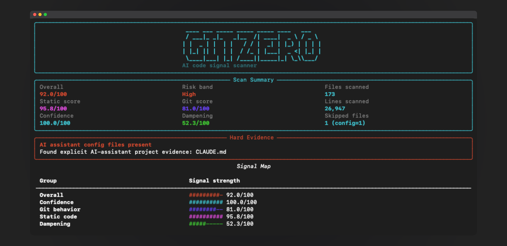
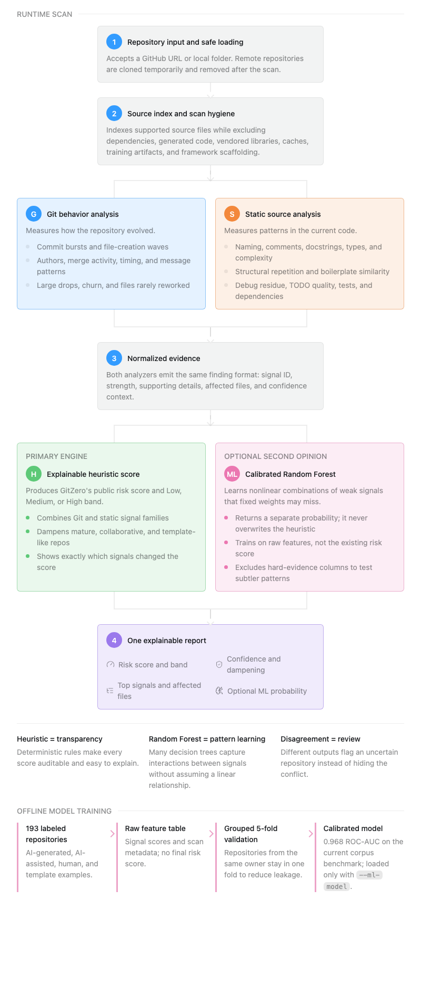

# GitZero

A CLI tool that scans any GitHub repository for signals consistent with AI-generated or AI-assisted code. Analyzes 25+ behavioral and static signals across git history and source files, outputs an explainable risk report, and includes a full ML training pipeline.

→ **[Full project writeup and demo](https://www.ivansostaric.com/projects/gitzero)**

---



---

## How It Works

GitZero uses a hybrid detection pipeline: deterministic heuristics produce the primary explainable score, while an optional calibrated Random Forest provides a separate learned probability.



1. **Load and filter the repository.** GitZero accepts a local folder or public GitHub URL, builds a source-file index, and excludes dependencies, generated code, vendored libraries, caches, training artifacts, and framework scaffolding.
2. **Analyze two evidence families.** Git history analysis measures repository behavior over time, while static analysis examines patterns in the current source code.
3. **Normalize and score the evidence.** Findings use a common signal format containing a score, supporting details, affected files, and confidence context. The heuristic combines independent signal families and applies false-positive dampeners.
4. **Produce an explainable report.** The CLI shows the risk score, Low/Medium/High band, confidence, dampening, top signals, highest-signal files, and optional ML probability.

### Why Use an ML Model?

The Random Forest is an **optional second opinion**, not a replacement for the explainable heuristic. Its purpose is to learn nonlinear interactions between weak signals that fixed weights may miss.

- It trains on raw signal and scan-metadata features, not GitZero's final `risk_score`.
- Hard-evidence columns are excluded so the model must learn subtler repository patterns.
- Its probability is reported separately and never overwrites the heuristic result.
- A disagreement between the two methods indicates uncertainty and gives the reviewer a reason to inspect the evidence.

The current calibrated Random Forest was evaluated with owner-grouped 5-fold cross-validation on 193 labeled repositories and reached **0.968 ROC-AUC** on that corpus. This is a project benchmark, not a claim of universal authorship-detection accuracy.

---

## What It Detects

**Git signals** — large commit bursts, file creation waves, single-drop histories, no-merge linear histories, formulaic commit messages, author uniformity, tight commit time clustering.

**Static signals** — naming entropy, docstring density, type annotation coverage, complexity uniformity, structural repetition, debug artifact absence, generic TODOs, shallow test quality, README-to-code misalignment.

**Hard evidence** — explicit AI config files: `AGENTS.md`, `CLAUDE.md`, `.cursorrules`, `.aider`, Copilot instructions, and README phrases like `vibe coded` or `built with ChatGPT`.

**False-positive guards** — vendor libraries (jQuery, Bootstrap), framework scaffolding, multi-author history, merge commits, and long-lived organic repos all reduce the score automatically.

---

## Highlights

- 25+ detection signals with per-signal weights and confidence scoring
- Jupyter notebook support — extracts and analyzes `.ipynb` code cells
- ML pipeline: Random Forest with grouped cross-validation on 193 labeled repos — **0.968 ROC-AUC** without hard-evidence features ([evaluation summary](corpus/_prep/corpus_summary_v7.md))
- Batch export to JSONL/CSV with ML-ready feature columns for every signal
- `--ml-model` flag for experimental probability alongside the heuristic score
- 50+ tests, ruff clean

---

## Install

```bash
pip install gitzero
```

## Usage

```bash
gitzero scan https://github.com/user/repo     # scan any public GitHub repo
gitzero scan ./my-local-repo --verbose        # show per-file signal breakdown
gitzero scan ./my-local-repo --json           # machine-readable output
gitzero batch ./corpus --recursive --label-from-parent --format jsonl -o out.jsonl
```

---

**Stack:** Python · Typer · Rich · PyDriller · radon
